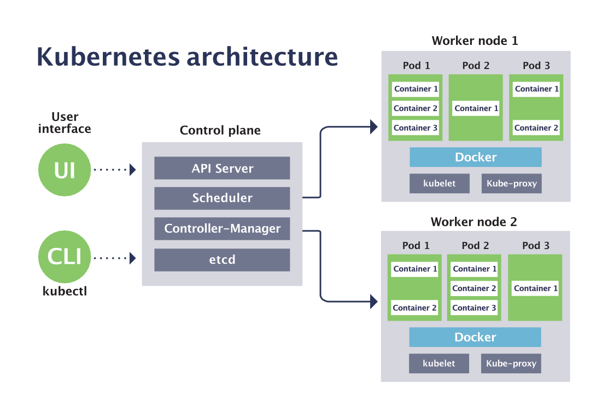
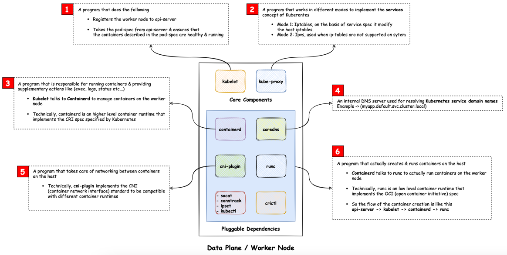
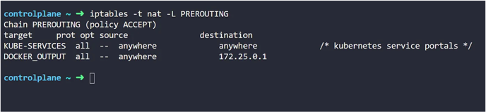
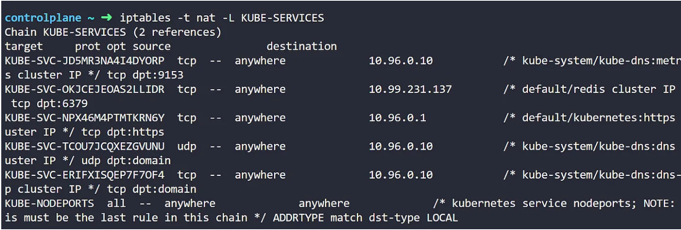
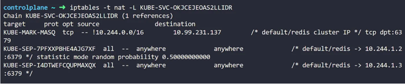
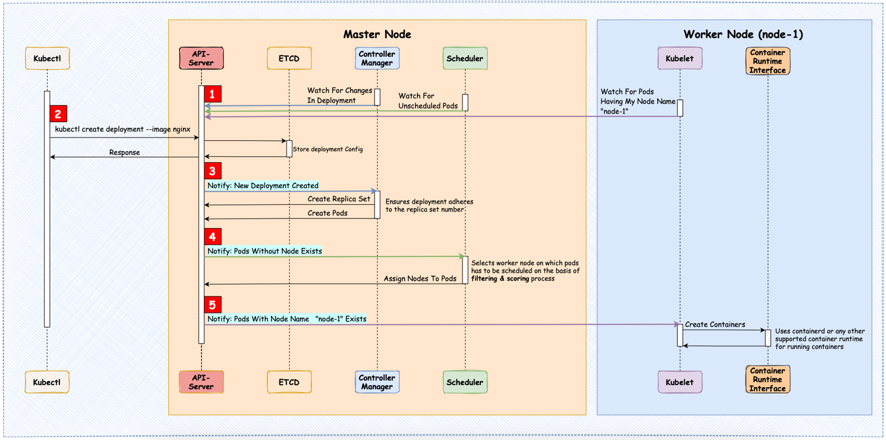
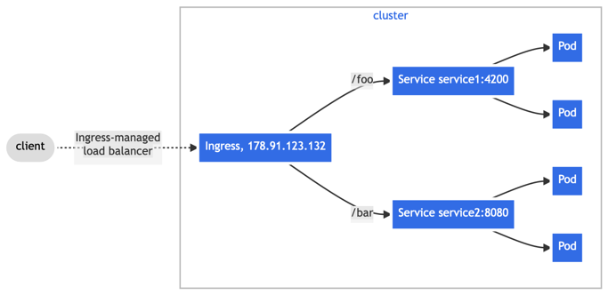

[](https://app.travis-ci.com/mtumilowicz/kubernetes-workshop)
[](https://www.gnu.org/licenses/gpl-3.0)

# kubernetes-workshop

* references
    * https://www.manning.com/books/kubernetes-for-developers
    * https://kubernetes.io/docs/reference/command-line-tools-reference/kubelet/
    * https://www.manning.com/books/kubernetes-in-action
    * https://www.manning.com/books/learn-kubernetes-in-a-month-of-lunches
    * https://medium.com/google-cloud/understanding-kubernetes-networking-pods-7117dd28727
    * https://kubernetes.io/blog/2018/04/30/zero-downtime-deployment-kubernetes-jenkins/
    * https://kubernetes.io/docs/concepts/overview/working-with-objects/kubernetes-objects/
    * https://matthewpalmer.net/kubernetes-app-developer/articles/how-does-kubernetes-use-etcd.html
    * https://sensu.io/blog/how-kubernetes-works
    * https://kubernetes.io/docs/reference/command-line-tools-reference/kube-scheduler
    * https://dominik-tornow.medium.com/the-kubernetes-scheduler-cd429abac02f
    * https://kubernetes.io/docs/reference/command-line-tools-reference/kube-apiserver/
    * https://kubernetes.io/docs/tasks/configure-pod-container/configure-liveness-readiness-startup-probes/
    * https://www.cyberark.com/resources/threat-research-blog/using-kubelet-client-to-attack-the-kubernetes-cluster/
    * https://stackoverflow.com/questions/48956049/what-is-the-difference-between-persistent-volume-pv-and-persistent-volume-clai
    * https://medium.com/devops-mojo/kubernetes-storage-options-overview-persistent-volumes-pv-claims-pvc-and-storageclass-sc-k8s-storage-df71ca0fccc3
    * [12 Ways of the Cloud Native Warrior - Burr Sutter - part 1/2](https://www.youtube.com/watch?v=M7yNrA82eU8)
    * [12 Ways of the Cloud Native Warrior - Burr Sutter - part 2/2](https://www.youtube.com/watch?v=bujAAujYjJg)
    * [The ultimate introduction to Kubernetes - Pascal Naber](https://www.youtube.com/watch?v=HUW-VZ9OEos)
    * [Nicolas Frankel - Zero-downtime deployment with Kubernetes, Spring Boot and Flyway](https://www.youtube.com/watch?v=RvCnrBZ0DPY)
    * [Akka and Kubernetes, the beginning of a beautiful relationship - Hugh McKee](https://www.youtube.com/watch?v=CjkiznureoU)
    * [Continuous deployment to Kubernetes with the Google Container Tools by David Gageot](https://www.youtube.com/watch?v=3nfNP00Tv1k)
    * [Canary Deploys with Kubernetes and Istio by Jason Yee](https://www.youtube.com/watch?v=VU2ILSrpy_Y)
    * [2018 - Mateusz Dymiński - Zero-Downtime deployments of Java applications with Kubernetes](https://www.youtube.com/watch?v=TVB-sQfJBLc)
    * [Develop and Deploy to Kubernetes like a Googler by David Gageot](https://www.youtube.com/watch?v=YYJ4RZFw4j8)
    * [Day Two Kubernetes: Tools for Operability](https://www.youtube.com/watch?v=ujg2UuBm-Rs)
    * [Hugh Mckee - Building Stateful Clustered Microservices with Java, Actors, and Kubernetes](https://www.youtube.com/watch?v=AJD4RjYRIaU)
    * [Kubernetes Distilled - an in depth guide for the busy Java developer by Alberto Rios & Oliver Hughes](https://www.youtube.com/watch?v=l7lt6yYLvRo)
    * [Transform a Legacy Application with Kubernetes and Istio - David Gageot](https://www.youtube.com/watch?v=6jBetJgluEE)
    * [Serverless with Knative - Mete Atamel](https://www.youtube.com/watch?v=Yf8heIFnFOc)
    * [[VDZ19] Service Mesh and Sidecars with Istio and Envoy by Rafael Benevides](https://www.youtube.com/watch?v=KLBFR_rUreE)
    * [Better Canary Deploys with Kubernetes and Istio by Jason Yee](https://www.youtube.com/watch?v=R7gUDY_-cFo)
    * [Optimising Kubernetes deployments with Helm by Erwin de Gier](https://www.youtube.com/watch?v=TXZBuBQpm-Q)
    * [9 Steps to Awesome with Kubernetes by Burr Sutter](https://www.youtube.com/watch?v=ZpbXSdzp_vo)
    * [DevOpsDays Warsaw 2019 - Dawid Ziółkowski - Istio MasterClass](https://www.youtube.com/watch?v=Z0X0NmVXk0g)
    * [JDD 2019: Wprowadzenie do Kubernetes [PL], Krzysztof Dziankowski](https://www.youtube.com/watch?v=e_j4S0Qqzwk)
    * [Beyond Kubernetes by Ray Tsang, Eric Bottard](https://www.youtube.com/watch?v=HEWb1IWqT30)
    * [Just DevOps 2019 - Mariusz Gil - Service mesh with Istio [PL]](https://www.youtube.com/watch?v=kRrfXVHBZjA)
    * [WJUG #266 - Matt Jarvis - Introduction to KUDO - Kubernetes operators the easy way](https://www.youtube.com/watch?v=oHu0WvxOJ2s)
    * [WJUG #270 ONLINE - Krzysztof Suszyński - Knative, Serverless w Kubernetes oraz OpenShift](https://www.youtube.com/watch?v=eYr_E4Qmta4)
    * https://chatgpt.com/
    * https://kubernetes.io
    * https://medium.com/@amroessameldin/kube-proxy-what-is-it-and-how-it-works-6def85d9bc8f
    * https://dzone.com/articles/journey-of-deployment-creation-in-kubernetes
    * https://dzone.com/articles/kubernetes-services-explained-cluster-ip-nodeport
    * https://dzone.com/articles/journey-of-http-request-in-kubernetes-1
    * https://medium.com/@danielepolencic/kubernetes-challenge-1-counting-endpoints-9d9c49dac2aa
    * https://medium.com/@muppedaanvesh/a-hands-on-guide-to-kubernetes-endpoints-endpointslices-%EF%B8%8F-1375dfc9075c
    * https://kubernetes.io/docs/concepts/services-networking/ingress/
    * https://www.getambassador.io/resources/kubernetes-ingress
    * https://konghq.com/blog/learning-center/what-is-kubernetes-ingress
    * https://medium.com/devops-mojo/kubernetes-ingress-overview-what-is-kubernetes-ingress-introduction-to-k8s-ingress-b0f81525ffe2
    * https://www.solo.io/topics/kubernetes-api-gateway/kubernetes-ingress/
    * https://www.bmc.com/blogs/kubernetes-ingress/
    * https://www.kerno.io/learn/kubernetes-ingress
    * https://medium.com/@maheshwar.ramkrushna/rbac-in-kubernetes-b6c4c23432ef
    * https://medium.com/rahasak/kubernetes-role-base-access-control-with-service-account-e4c65e3f25cc
    * https://github.com/ahmetb/kubernetes-network-policy-recipes/blob/master
    * https://stackoverflow.com/questions/65017380/kubernetes-network-policy-deny-all-policy-not-blocking-basic-communication
    * https://stackoverflow.com/questions/54168082/how-to-enable-network-policies-in-docker-for-mac-with-kubernetes
    * [Devoxx Greece 2024 - The Art of Debugging Inside K8s Environment by Andrii Soldatenko](https://www.youtube.com/watch?v=kKO59z58en8)
    * [Devoxx Greece 2024 - Kubernetes Resiliency by Chris Ayers](https://www.youtube.com/watch?v=R4u5bvWceBQ)

## preface
* goals of this workshop
    * introduction into k8s architecture
        * Control Plane vs Minions
    * understanding components of Worker Nodes
       * kube-proxy, kubelet
    * description of basic building blocks for workload deployments
    * introduction into k8s networking
    * general overview of handling storage
    * understanding security and basic methods of troubleshooting
* workshop plan
    1. deploy `customer` and `customer-info` microservice
        * notice how `customer` is deployed wit correct `SPRING_PROFILES_ACTIVE`
            * and how it affects `application.yml` properties
        * deploy resources
            * commands
                ```
                kubectl apply -f namespace.yml
                kubectl apply -f deployment.yml
                kubectl apply -f service.yml
                ```
            * in directories
                * cd k8s/customer-gateway
                * cd k8s/customerinfo
    1. port forward `customer-gateway` to `localhost:8080`
        * verify it is working: http://localhost:8080/actuator/health
    1. port forward `customerinfo-app` to `localhost:8081`
        * http://localhost:8081/actuator/health
    1. verify that `customer-gateway` is able to communicate with `customerinfo-app`
        * curl http://localhost:8080/customer/123/full-info
            * to get full info, `customer` is querying `customerinfo`

## introduction
* rationale
    * problem: running containers on dedicated individual machines
    * solution: utilize a shared pool (cluster) of interconnected machines (nodes) and container orchestrator
        * container orchestrator responsibilities
            * dynamically manages and distributes container workloads across resource pool
            * optimizes resource utilization, enhancing scalability, and improving fault tolerance
* kubernetes
    * abstraction layer that sits at the workload level on top of the raw compute primitives like VMs
    (or bare metal machines) and load balancers

## architecture
* overview
    
* Master (Control Plane)
    * decision-making components
    * is offered as a managed service
    * API Server (kube-apiserver)
        * provides the frontend to the Kubernetes control plane
            * example
                * checking the status of a pod
                * scheduling a new workload
                * modifying a resource
                * registration of worker nodes
        * all other components interact through with it
            * example
                * kubelet (on worker nodes)
                * controller-manager,
                * external clients like kubectl
        * provides RESTful interface
        * authenticates and authorizes
    * Scheduler (kube-scheduler)
        * assigns Pods to Nodes
            * tries to spread Pods across available nodes
            * doesn't enforce strict Pod spreading rules
                * unless specific affinity or anti-affinity rules are applied
                * most Kubernetes platforms enable default Pod-spreading policies
                    * example: across multiple zones
        * scheduling is an optimization problem:
            1. filtering
                * goal: determine feasible placements (placements that meet given constraints)
                * filters out the worker nodes that cannot host the pod for some reason
                    * example: CPU and Memory requests
                * output: nodes on which pods can be scheduled
                    * length == 0 => pod will remain pending till this condition is remedied
                    * length == 1 => scheduling can occur without any actions
                    * length > 1 => moves to the next stages of scheduling
            1. scoring
                * goal: determine viable placements (feasible placements with the highest score)
                * example of rules used for evaluation:
                    * node affinity and anti-affinity
                    * does the node have a container image already?
                        * no image => it will take time to pull it
                    * lower workload utilization will give you a higher result
                * output: node with the highest score is selected for the scheduling of Pod
        * `topologySpreadConstraints`
            * automatically spread workloads across different topologies
                * example: nodes, zones, racks, regions
    * etcd
        * rationale: Kubernetes is distributed => it needs a distributed database
        * distributed key-value store
        * store all k8s data
            * anything you might read from a `kubectl get xyz` command is stored in etcd
            * any change you make via `kubectl create` will cause an entry in etcd to be updated
            * any node crashing or process dying causes values in etcd to be changed
        * stores actual state of the system and the desired state of the system
            * if diverge => reconciliation
        * provides events on changes happening to its keys
            * exposed over the watch API
            * Kubernetes uses it to monitor changes
                * controllers (e.g., Deployment, ReplicaSet controllers)
                    * ensure that the cluster's actual state matches the desired state
    * Controller Manager (controller-manager)
        * resource that manages other resources
        * comprises many resource controllers: replication controller, endpoints controller, namespace controller, etc
        * compares current state to the desired state of its resources, and makes any changes necessary
            * watches for changes in a specific Kubernetes resource using the watch API exposed by the api-server
            in a never-ending for loop called the control loop
        * use a label selector to identify the resources they manage
            * simple key-value pairs
            * used to loosely couple resources
            * example
                * Deployment's spec has a `selector.matchLabels` section
                * PodSpec has a `metadata.labels` section
                * reason: we need a way to reference Pod from the Deployment
                    * Pod object actually exists somewhat separately after creation
                * why it cannot be referenced out of the box as PodSpec is part of Deployment?
                    * Pods may be needed in other objects
                        * in particular: network Service references Pod directly, not Deployment
* Minion (Worker Node)
    * components that execute the decisions made by Control Plane
        
    * Pod
        * a unit of compute, which runs on a single node in the cluster
            * scheduled according to the resources
                * example: 2 CPU to run workload
                * Horizontal Pod Autoscaler (HPA)
                    * automatically scales the number of Pods based on target metrics
                        * build in: cpu, memory
                            * source: Kubernetes Metrics Server
                        * custom: rps, latency, etc
                            * source: custom metrics provider
                                * example: Ingress
                    * applicable to: deployment, replica set, or stateful set
                    * use case
                        * scaling web applications based on traffic
                        * scaling background workers based on job queue size
                        * scaling services based on request latency or throughput
        * short-lived/ephemeral
            * if a pod dies for any reason, K8s will automatically restart the pod
                * IP address assigned to that pod changes
        * an abstraction
            * just a logical grouping of containers
                * often: just a single container
                * sidecar: additional containers that should be deployed together with main application
                    * example: authorization, logging
                * Kubernetes binds them together ensuring they have common lifecycle
                    * example
                        * created together
                        * one fails => they are restarted
                        * terminated together
            * there is no notion of Pod in processes running on the node
                * just a bunch of processes from the containers
        * like a separate logical machine
            * with its own IP, hostname, processes, and so on
                * `kubectl get pods <pod-name> -o wide`
            * own network namespace
                * no port conflict between Pods
                * example: multiple Pods can run a container on port 80
            * consists of 1+ containers in the same Linux namespace(s)
                * all the containers in a pod will appear to be running on the same logical machine
                    * containers in other pods, even on the same worker node, will appear to be running on a different one
        * can communicate with all other Pods in the cluster directly (over virtual network)
            * without needing NAT (Network Address Translation)
    * kubelet
        * daemon that runs on every node
            * is also deployed on the master to run the Control Plane components as pods
            * primary "node agent"
        * works in terms of a PodSpec (object that describes a pod)
            * uses a combination of polling and watching to receive updates about the desired state of resources
        * responsibilities
            * initial task: register the node it’s running on by creating a Node resource
                * sends regular heartbeats to the API server to confirm that the node is healthy and available
            * continuously checks for Pods scheduled to the node and starts them
                * digression: Kubernetes doesn’t really run containers
                    * it passes the responsibility to the container runtime installed on the node
                        * example: Docker, Podman, rkt
                            * rkt is dead: https://news.ycombinator.com/item?id=22249403
            * runs the container readiness/liveness probes, restarting containers when the probes fail
                * Pod is considered ready/live when all of its containers are ready/live
                * reports back to the API server on a timely basis
                    * API server uses these updates to
                        * track the state of the cluster
                        * make scheduling decisions
    * kube-proxy
        * runs on each node
        * overcomes the problem of Pods’ IPs being changed each time a Pod is recreated
        * configuration of request routing on the OS level is done by configuring the IP tables of the OS
            * configuration of IP tables is done by the kube-proxy
                * doesn’t receive the actual traffic or do any load balancing
                * translates Service definitions into networking rules as NAT (Network Address Translation)
                    * NAT rules are simply mappings from Service IP to Pod IP
                        * example: traffic sent to a Service => redirected to a backend Pod
                            * NAT rules pick one of the Pods according to used mode
                                * iptables -> random, IPVS -> algorithm
                    * example
                        1. KUBE-SERVICES is a custom chain created by Kube-Proxy for the Services
                            
                        1. traffic destined to the Service will enter appropriate chain
                            
                            * example: notice a specific chain created with a rule for destination IP of the Service (10.99.231.137)
                        1. NAT rules
                            
                            * notice this statistic mode random probability
                            * KUBE-SEP correspond to the Service endpoints (SEP)
                                * contains IP address of each Pod listed for each chain
        * modes
            * iptables
                * default and most widely used
                * relies on a Linux feature called iptables
                    * core feature of almost every Linux operating system
                * uses a sequential approach going through its tables
                    * it was originally designed as a packet filtering component
                    * number of lookups increases linearly by increasing the rules
                * doesn’t support specific load balancing algorithms
                    * uses a random equal-cost way of distribution
            * IPVS (IP Virtual Server)
                * Linux feature designed specifically for load balancing
                * optimized lookup algorithm with complexity of O(1)
                * supports different load balancing algorithms
                    * example: round robin, least connections, and other hashing approaches
                * might not be present in all Linux systems today
    * nodes autoscaling is not part of the base Kubernetes API
        * optional component in managed Kubernetes
            * example: GKE Autopilot
## resources
* Kubernetes objects
    * are persistent entities in the Kubernetes system
        * represent the state of the cluster
    * lifecycle can be managed with CRUD commands
        * `kubectl create`, `kubectl get`, `kubectl apply`, and `kubectl delete`
    * is a "record of intent"
        * specification for the desired state of the system
        * system will work to ensure the current state matches the desired state defined by these objects
            * example: Pod is just logical grouping - it does not exist physically
    * ownership
        * when controller is deleted, its managed objects still exist but not for long
            * Kubernetes runs a garbage collector process
        * can model a hierarchy
            * example: Pods owned by ReplicaSets, and ReplicaSets owned by Deployments
* Namespace
    * uses to group other resources
        * example
            * one namespace per product, one per team, or a single shared namespace
    * every resource lives inside a namespace
    * forms logical separation
        * provides isolation by name
            * example: pod named `web-app` in both `namespace-a` and `namespace-b`
        * do not create hard, physical boundaries
            * Role-Based Access Control (RBAC) for control access to resources at the namespace level
        * example: pods in different namespaces can communicate with each other by default
    * four initial namespaces:
        * default: objects with no other namespace
        * kube-system: objects created by the Kubernetes system
            * example: control plane (API server, controller manager, etc.)
        * kube-public: readable by all users (including those not authenticated)
            * mostly unused by default
            * use case: making cluster-wide, publicly accessible information available without authentication
        * kube-node-lease: used to manage NodeLease objects
            * each node in the cluster periodically updates its lease object
                * used by the control plane to determine the availability of nodes
            * helps improve the performance and scalability of large clusters
                * reducing load on etcd
## deploying workloads
* are all controllers
    * example: Deployment reads spec and creates a ReplicaSet
* Deployment
    * steps
        
    * rationale: instructing Kubernetes to run Pods directly is not safe
        * no automatic rescheduling
            * rebooted if crash, but not in case of node failure
        * no rolling updates or rollbacks
        * no scaling
    * strategy types
        * RollingUpdate
            * default deployment strategy
            * updates Pods incrementally
            * parameters (during the update process)
                * maxSurge
                    * how many additional Pods can be created
                    * tradeoff: higher the value => faster rollout but more resources used
                * maxUnavailable
                    * how many Pods can be unavailable
                        * more Pods can be replaced at once
                    * tradeoff: higher the value => faster rollout but temporarily reducing the  number of ready Pods
                    * rollout could coincide with another event that lowers availability
                        * example: node failure
        * Recreate
            * terminates all existing Pods before creating new ones
            * use case: applications that cannot tolerate having multiple versions running simultaneously
            * cons: downtime
    * technically, a deployment in Kubernetes is made of resources: Pods + Replica-Set
        * manages a ReplicaSet, which in turn manages the Pods
            ```
            spec:
              replicas: 1
              selector:
                matchLabels:
                  app: customerinfo-app
            ```
        * Pod object template is referred as the PodSpec
            ```
            spec:
              ...
              template:
                metadata:
                  labels:
                    app: customerinfo-app
                spec:
                  containers:
                    - name: customerinfo-app
                      image: customerinfo-app:0.0.1-SNAPSHOT
            ```
* ReplicaSet
    * Deployments should be first choice for defining applications
        * don't use ReplicaSets directly
    * constantly runs a control loop: #(objects it owns) == #(replicas it should have)
* Job, CronJob
    * use case: batch processing, periodic tasks
        * example: resizing images, sending out device notifications, data backups
    * has notation of completed Pod
        * terminating with an exit status of success
            * can't use the default restart policy: Always
            * Pod won’t be restarted
            * isn’t deleted when it completes - logs could be examined
        * should have liveness probes
            * we can ignore readiness
                * no Service that they can be added/removed based on readiness
    * vs Deployment
        * Job - tasks that are expected to complete (don’t need to run continuously)
        * Deployment - continuous application
            * doesn’t have the notation of a Pod "completing"
    * replacement for `kubectl exec` on an existing Pod
        * `kubectl exec` task is sharing the resources with the Pod
            * affecting the performance
            * Pod may not have enough resources to handle both
        * moving tasks to a Job => their own Pod with their own resource allocation
    * Job is Completed (by terminating with an exit status of success) => work is done
    * CronJob is a Job controller, which creates Jobs on a set interval
        * you can do anything in a CronJob that you can do in a Job
        * spawns a new Job on a schedule, which, in turn, spawns a new Pod
        * note that CronJob will run on the time zone of your cluster
            * usually UTC
* StatefulSet
    * rationale: data-heavy apps typically expect to run in a stable environment
        * Kubernetes is a dynamic environment
    * creates Pods with predictable names
        * created in order from zero up to n
            * started in order
                * previous Pod needs to be up and running before next is created
            * removed in the reverse order
        * can be individually accessed over DNS
        * resurrected Pod gets the same name, network identity, and state as killed one
    * vs Deployment
        * in the ReplicaSet, there is no way to identify a single Pod
            * all Pods share the same specification
    * can use this uniqueness and guaranteed ordering to assign different roles to the different unique Pods
        * example: primary instance and one or more secondaries
            * you might be able to scale the secondaries
                * but they all need to reach the primary
                    * for example to synchronize their own data
            * solution: Pod runs a script at startup, which checks to see if it is Pod 0
                * if it is, the Pod sets itself up as the primary
                * next Pod doesn’t start until Pod 0 is running
                    * same startup script tells Pod it is not the primary
                    * it sets itself as a secondary and synchronizes data from Pod 0
    * often used with headless Service
        * each Pod in the StatefulSet is unique => useful to be able to address them individually
* DaemonSet
    * runs a single replica of a Pod on every node in the cluster
        * or on a subset of nodes
    * skip the Kubernetes Scheduler
        * node goes down => pod is not created elsewhere
        * new node => pod is deployed to it
    * common for infrastructure-level concerns
    * use case: cluster operational reasons
    * example
        * administration: logging, monitoring, and security
        * kube-proxy

### networking
* Service
    * rationale: abstraction over a Pod and its network address
        * analogy: like a Deployment is an abstraction over a Pod and its container
        * there may be thousands of Pods
        * they all need to communicate
        * IP addresses change when Pods are replaced
    * network address discovery mechanism
        * provides and maintains a network identity for Pod resource
    * has internal, cluster-local IP address and DNS record
        * exception: headless Services
        * IP address is static for the life of the Service
        * can be referenced by other Pods
        * within a namespace, Services are available using a simple domain name
            * other namespaces: `<service-name>.<namespace>.svc.cluster.local`
    * spreads the load across the Pods
        * not linked directly to pods
            * contain a list of Endpoints (IPs and ports)
                * `kubectl get endpoints <service-name>`
                * example: Service that selects pods with the label `app=my-app` automatically creates
                corresponding endpoint
                    ```
                    apiVersion: v1
                    kind: Endpoints
                    metadata:
                      name: my-service
                    subsets:
                      - addresses:
                          - ip: 10.42.1.4
                          - ip: 10.42.1.5
                        ports:
                          - port: 8080
                            protocol: TCP
                    ```
            * link is set up with a label selector
                * just like the link between Deployments and Pods
    * routing type
        * default: ClusterIP
            * used for: internal traffic
            * provides static virtual IP address in the cluster
                * addressable from any Pod within your cluster
        * NodePort
            * used for: external traffic
                * usually in development environments
            * additionally randomly select any available port on the node/VM between 30000 - 32767
                * expose a service on a specific port on every node in the cluster
                    * port can be specified manually => problematic to check if the port is available on every node
                * app can be accessed using `nodeIP:exposedPort`
                    * to get exposed port: `kubectl get service <service-name>`
            * pros: gives you the freedom to set up your own load-balancing solution
            * cons: not practical for users
                * they usually want to use a domain name like `myapp.com`, not ips
        * LoadBalancer
            * used for: external traffic
            * is a superset of NodePort and ClusterIP service
            * managed Kubernetes service like EKS(AWS) provisions a load balancer by itself
                * you don’t have the hassle setting up a load balancer yourself
                * managed by: cloud controller manager
                    * pluggable component used to perform deep integration with the cloud provider
                        * provisioning Load Balancers, Persistent Storage, VMs, etc.
                    * every cloud provider has its own implementation
            * provides external static IP address on top of cluster ip
                * app can be accessed using `external-ip` taken from `kubectl get service <service-name>`
                * can be mapped to your domain name (using something like GoDaddy)
            * pros: takes away the trivial task of configuring and provisioning LBs
            * vs NodePort
                * not much difference
                    * rule of thumb: use the LoadBalancer service first
                * some automation being done in LoadBalancer
            * what the service controller does
                1. gets the list of pods that matches the selector field
                1. iterates over the pod list and notes down the IP address of the pod
                1. creates an internal static IP address called the clusterIP
                1. creates a new K8s resource called Endpoint which basically maps a single IP to multiple IPs
                    * single IP here is the clusterIP, and the multiple IPs correspond to the pod IPs
                    * one-to-one mapping between a Service and an Endpoint object
                        * Endpoint Slices are a more scalable and efficient way to manage endpoints
                            * introduced in Kubernetes 1.16
                            * multiple smaller Endpoint Slice objects are created
                                * each representing a portion of the endpoints
                    * has an endpoints column that is a collection of IP:port pairs
                    * pods get created/destroyed => responsibility of the service controller to update the endpoint resource
                1. exposes a random port (ranging from 30000-32768) on the worker node
        * problem: expose more than one application => multiple NodePort / LoadBalancer Services
            * with each NodePort service you need to deal with the hassle of manually managing the IPs and ports
            * with each LoadBalancer service, you go on increasing your cloud bill
            * solution: Ingress
        * addition: headless service
            * indicated by the clusterIP: None
            * no virtual cluster IP created to balance traffic
            * querying the Service will return multiple A Records (Address Records)
                * allows clients to directly address specific Pods
* Ingress
    * rationale: layer-7 (L7) load balancer
        * Service Load Balancer
            * is layer-4 (L4) load balancer
                * balances requests at the network layer (e.g., TCP, UDP, SCTP)
            * only able to direct toward one service
    * overview
        
        * typical Kubernetes application has pods running inside a cluster and a network load balancer (NLB) outside
            * NLB takes connections from the internet and routes the traffic to an edge proxy that sits inside cluster
                * edge proxy is commonly called an ingress controller
            * NLB provides basic traffic distribution to the cluster, while Ingress gives you the ability to define more detailed rules
            * example: access api.example.com
                1. DNS Resolution
                    * api.example.com is resolved to the IP address of the Ingress Controller's external load balancer
                1. load balancer forwards the HTTP request to the Kubernetes Ingress Controller
                1. routing decision + service discovery
                    * example: Service of type ClusterIP
                1. pod selection and routing
                    * Service forwards the request to one of the available Pods
    * components
        * Ingress Controller
            * smart proxy running in K8s
            * can be placed in any namespace
                * automatically detect Ingresses defined in other namespaces
                    * based on field `ingressClassName`
            * specialized load balancer running in cluster that handles the routing based on the Ingress rules
                * actual implementation of the Ingress API
            * can be a software load balancer, external hardware load balancer, or cloud load balancer
                * each type requiring different controller implementations
            * could be more than one Ingress Controller at the same time in a Kubernetes cluster
                * Kubernetes supports a resource named `IngressClass` that contains which controller it refers to
                * example: different controllers for development, staging, and production
            * examples
                * AKS Application Gateway Ingress Controller
                * Istio Ingress
                * Kusk Gateway
                * NGINX Ingress Controller For Kubernetes
        * Ingress Resource
            * describes the desired state for exposing services to the outside of the Kubernetes cluster
            * set of routing rules that determine how to route incoming requests to different services within the cluster
                * host-based routing
                    * example
                        * typical HTTP GET
                            ```
                            GET /v1/users HTTP/1.1
                            Host: api.example.com // here we specify host
                            User-Agent: curl/7.68.0
                            Accept: */*
                            ```
                        * `api.example.com` should route to Service 1
                        * `frontend.example.com` should route to Service 2
                * path-based routing
                    * example
                        * requests with the URI that starts with `/serviceA` to service A
                        * requests with the URI that starts with `/serviceB` to service B
            * should be created in the same namespace where the corresponding K8s Service resides
        * analogy
            * Ingress Resource ~> `nginx.conf` file
            * Ingress controller ~> nginx webserver
    * needs Service (NodePort/LoadBalancer) in front of it to expose it
        * NodePort: allows external traffic to access the service via any node's IP
        * LoadBalancer: exposes the service externally with a public IP address
            * commonly used in cloud environments (like AWS, GCP, or Azure)
                * cloud provider creates a Load Balancer in front of Ingress controller to route traffic into the cluster
    * pros
        * single point of entry
            * centralizing
                * traffic routing
                * load balancing
                    * expose multiple services under the same IP address
                * secure access, certificate management
                    * may result in performance gains: so-called TLS terminator
                        * handle the TLS connection and rest of backend communication is done only over
                        HTTP via a secure network
                        * there is no option to pass the unmodified encrypted traffic directly to the backend
                            * can re-encrypt traffic and connect to your services over HTTPS
            * decreases the attack surface of the cluster
        * cloud cost cut
            * rationale: cloud providers often charge based on how many load-balancing external IP addresses are assigned
                * Ingress combines several services into one
                    * rather than each being exposed with its own IP
                * example: AWS Kubernetes (EKS) + AWS Load Balancer Ingress Controller => each Ingress creation will provision an AWS Load Balancer
                    * they charge for each Load Balancer and public IP address
        * can be used to implement canary deployments
    * Ingress vs Egress
        * analogy: immigration and emigration
        * Ingress: incoming traffic to cluster
            * Kubernetes resource with dedicated controllers and configurations
        * egress: outgoing traffic from cluster
            * mechanism of establishing connections to resources outside the cluster
                * example: databases, APIs etc
            * managed through network policies, firewall rules, or other networking configurations
                * example: block any outgoing external communication apart to kafka
                    * global block all egress policy
                        ```
                        apiVersion: networking.k8s.io/v1
                        kind: NetworkPolicy
                        metadata:
                          name: block-all-egress
                          namespace: default  # Set the correct namespace
                        spec:
                          podSelector: {}  # Apply to all pods
                          policyTypes:
                            - Egress
                          egress: []  # Empty egress block means no outgoing traffic is allowed
                        ```
                    * selective allow egress policy
                        ```
                        apiVersion: networking.k8s.io/v1
                        kind: NetworkPolicy
                        metadata:
                          name: allow-kafka-egress
                          namespace: default  # Set to your appropriate namespace
                        spec:
                          podSelector:
                            matchLabels:
                              app: my-app  # Pods that need access to Kafka
                          policyTypes:
                            - Egress
                          egress:
                            # Allow traffic to Kafka broker IP
                            - to:
                                - ipBlock:
                                    cidr: 192.168.100.100/32  #IP of Kafka broker
                              ports:
                                - protocol: TCP
                                  port: 9092  # Default Kafka port for communication
                        ```
    * vs Kubernetes API Gateway
        * more comprehensive solution for managing external access to services
            * support for various protocols and advanced traffic management features
                * example: authentication, rate limiting, request/response transformation, monitoring, and caching
### Config
* Kubernetes supports configuration injection with two resource types: `ConfigMaps` and `Secrets`
* `ConfigMap`
    * rationale: stores some data that can be loaded into a Pod
        * pod descriptor is source code => configuration should be moved out of the pod description
    * key/value pairs
    * contents are passed to containers as either environment variables or as files in a volume
        * application doesn’t even know that ConfigMap exists
    * can be used to store entire files
        * typically, these files would be configuration files
            * my.cnf for MariaDB, redis.conf for Redis
        * example
            1. spring boot `application.yml` + https://github.com/ahilsend/vaultify
                * https://github.com/mtumilowicz/java-springboot-cloud-vault-workshop
            1. redis image + mount config file using ConfigMap
                * no need to build image just to provide this one file
    * Pod must be in the same namespace
* `Secret`
    * https://github.com/mtumilowicz/bitnami-sealed-secrets-workshop
    * every pod has a secret volume attached to it automatically
        * contains three entries: `ca.crt`, `namespace`, and `token`
            * everything to securely talk to the Kubernetes API server
    * Pod must be in the same namespace
### Storage
* managing data adds a lot of complexity to your Kubernetes applications
    * problems: backups, snapshots, rollbacks
        * a managed database service will probably give you that out of the box
    * should you even use k8s to run stateful apps like databases?
* analogy
    * nodes are the Kubernetes representation of a VM
    * volumes are the Kubernetes representation of a disk
* `PersistentVolume`
    * abstraction for the physical storage device that attached to the cluster
    * disk resources themselves
    * low level representation of a storage volume
    * independent of the lifecycle of the Pods
    * not namespaced, it is available to whole cluster
    * types
        * AWS Elastic Block Store (EBS)
        * GCE Persistent Disk
        * etc
* PersistentVolumeClaim
    * can be thought of as a request for resources
        * platform-agnostic terms
        * example: 1 megabyte of storage
    * has a lifecycle that starts as a request and becomes a claim when bound
        * example: PersistentVolumeClaim after it’s bound is updated with `volumeName` of linked volume
        * is deleted => PV and the disk resource that backs it are deleted
            * default `reclaimPolicy`: Delete
                * `Retain` = disk resource is not deleted
    * binding between a Pod and Persistent Volume
        * Pod request the Volume through the PVC
    * when created => k8s creates/matches it with a PersistentVolume
        * `StorageClass` allows for dynamic provisioning of Persistent Volumes
            * abstracts underlying storage provider
                * example: cloud provider
            * bind to PVC with `storageClassName`
    * StatefulSet
        * stable Pod identifier is linked to a particular PVC
        * deleted => PVC not removed
        * re-create => PVC reattached
            * no data lost
        * `volumeClaimTemplates` ~ Pod template in Deployment
            * each Pod will have a PVC created based on this template
            * PVC name: {pvc-name}-{pod-name}
                * example: postgres-pvc-postgres-0
    * PV vs PVc
        * PVs are resources in the cluster
        * PVCs are requests for those resources and also act as claim checks to the resource
* `EmptyDir`
    * allocated on space from the node’s boot disk
        * node becomes unhealthy => all data is lost
        * Pod is deleted or moved to another node => cannot access data
    * use case: share data between containers in the same Pod
        * pods can have multiple containers
            * `emptyDir` mounts can be shared between them
        * example
            1. on-disk cache
            1. init container setup steps for the main container
### Security
* security
    * Pod's `securityContext` properties
        * Kubernetes admission controller can be used to automatically add it to every Pod
            * executed via webhooks when you create an object
            * two types
                * validating
                    * accept or reject the Kubernetes object
                * mutating
                    * modify (or mutate) the incoming requests
                    * executed before the objects are persisted in etcd
        * limit what functions Pod can use
            * by default: Pod is free to request whatever capabilities it wants
                * example: root access
                    * risk: anyone with kubectl access to the cluster has root privileges
            * important fields
                * `runAsNonRoot`
                    * distinct from having root on the node
                * `runAsUser`
                    * root is always user 0
                * `allowPrivilegeEscalation`
        * steps
            1. Webhook Service Deployment
                * `image: your-webhook-image:latest`
                    * example: webhook handler written in go
            1. Webhook Service
            1. MutatingWebhookConfiguration
    * role-based access control (RBAC)
        * managing access to resources
            * allow or deny access to a resource
        * example
            * ensure that developers only deploy certain apps to a given namespace
            * infrastructure management teams have view-only access for monitoring tasks
        * subjects
            * `User`
                * human users
            * `ServiceAccount`
                * provides an identity for a process that runs in a pod
                    * non-human account
                * has an associated token that Pods can use to authenticate against the Kubernetes API server
                    * mounted to it as a secret
                * every pod created without specifying a Service Account gets assigned the default
                    * default Service Account is created every time namespace is created
        * components
            * Role
                * set of permissions that grants access to resources in a specific namespace
            * RoleBinding
                * associates a set of users or groups with a Role
            * ClusterRole/ClusterRoleBinding
                * cluster-wide (across all namespaces)
        * authorization flow
            1. identify the namespace of the resource being accessed
            1. verifying if there is a matching Role or ClusterRole
            1. checking if User/ServiceAccount is included in the RoleBinding
        * does not control network access
            * example: does not prevent Pods from sending network requests to each other
            * solution: network policy
    * Network policies
        * by default, every Pod can talk to every other Pod
            * in particular: across namespaces
        * control traffic to and from the network and other Pods
            * example: restrict Pods in a namespace from being accessed from other namespaces
                ```
                kind: NetworkPolicy
                apiVersion: networking.k8s.io/v1
                metadata:
                  namespace: namespace1
                  name: deny-from-other-namespaces
                spec:
                  podSelector:
                    matchLabels:
                  ingress: // policy pertains to ingress traffic
                  - from:
                    - podSelector: {} // selects all Pods in namespace1
                ```
        * requires a controller to be installed to enabled the enforcement of NetworkPolicy rules
            * no default when creating a cluster => policy will have no effect
            * implemented by the Container Network Interface (CNI) plugins
                * Flannel
                * Calico
                * Weave Net
                * Cilium
                * Kube-Router
    * container security
        * https://github.com/mtumilowicz/spring-boot-webapp-docker-workshop
## troubleshooting
* `kubectl describe pod $POD_NAME`
    * view details about its events, container statuses, resource limits
    * usable
* `kubectl logs $POD_NAME`
* `kubectl exec -it <pod> sh`
    * open an interactive shell session inside a running container
    * problem: images are usually distroless
        * https://github.com/GoogleContainerTools/distroless
        * contain only your application and its runtime dependencies
            * do not contain package managers, shells or any other programs you would expect
            to find in a standard Linux distribution
        * solution
            1. ephemeral debug container
                * are temporary containers that can be added to an existing pod specifically for debugging purposes
                    * without needing to restart or modify a running pod
                * `kubectl debug -it <pod> --image=... --target=<container> --sh`
                    * adds a temporary container to the pod
            1. copy pod
* typical errors
    * `ERRIMAGEPULL`, `ERRIMAGEPULLBACKOFF`
        * Kubernetes is unable to download the container image
        * root causes
            * image name was misspelled in configuration
            * image doesn’t exist in repository
            * cluster cannot access the repository
                * example: network or authentication issue
    * stuck in pending
        * Pod has been accepted by the cluster, but it cannot be scheduled onto a node
        * root causes
            * scheduler is unable to find space to deploy
        * fix
            * check the event log for `FailedScheduling`
            * relax affinity rules or node selectors
    * CrashLoopBackOff
        * Pod is repeatedly crashing after starting
        * root causes
            * container failed to start
            * container crashes soon after starting
            * readiness/liveness probes are failing, causing Kubernetes to restart the Pod.
        * fix
            * check logs
                * for application errors
                    * example: "Port already in use", "Failed to connect to database", etc
            * adjust liveness/readiness probes if they are too strict
                * example: too long db migrations
    * RunContainerError
        * container runtime failed to start the container after it was created
        * root causes
            * misconfigured command or args fields in the Pod spec
            * insufficient resources, such as CPU or memory, during startup
